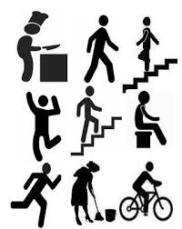

# Human Activity Recognition

This case study is to build a model that predicts the human activities such as Walking, Walking_Upstairs, Walking_Downstairs, Sitting, Standing or Laying.
This dataset is collected from 30 persons(referred as subjects in this dataset), performing different activities with a smartphone to their waists. The data is recorded with the help of sensors (accelerometer and Gyroscope) in that smartphone. This experiment was video recorded to label the data manually.

# Dataset

By using the sensors(Gyroscope and accelerometer) in a smartphone, they have captured '3-axial linear acceleration'(_tAcc-XYZ_) from accelerometer and '3-axial angular velocity' (_tGyro-XYZ_) from Gyroscope with several variations.
 - prefix 't' in those metrics denotes time.
 - suffix 'XYZ' represents 3-axial signals in X , Y, and Z directions.
 
Y_Labels(Encoded): 
In the dataset, Y_labels are represented as numbers from 1 to 6 as their identifiers.
- WALKING as 1
- WALKING_UPSTAIRS as 2
- WALKING_DOWNSTAIRS as 3
- SITTING as 4
- STANDING as 5
- LAYING as 6
    
 # Deep Learning Models :
 
Three models were trained for:
 - To classify whether it is dynamic or static activity.
 - Dynamic Activities (Walking, upstairs, downstairs)
 - Static Activities  (sitting, standing, lying)
We have used:
 - <b> 1d CNN and 1-layer LSTM </b> for type of activity classification.
 - <b> 1d CNN and 1-layer LSTM </b> for dynamic activities.
 - <b> 3 (1d CNN + MaxPooling) </b> for static activities.
      
  # Results:
  
  We have achieved,
  Train accuracy: <b>0.9880304678998912</b>
  Test accuracy:  <b>0.9681031557516118</b> 
